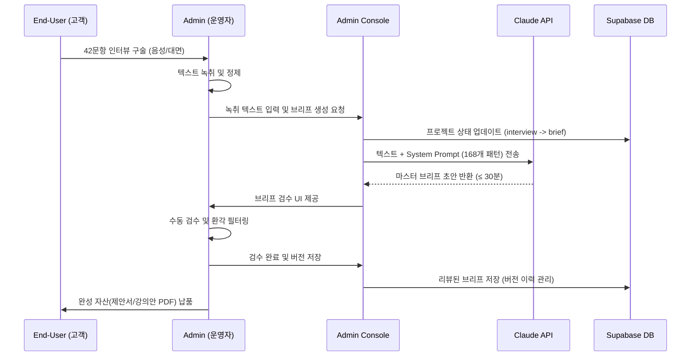
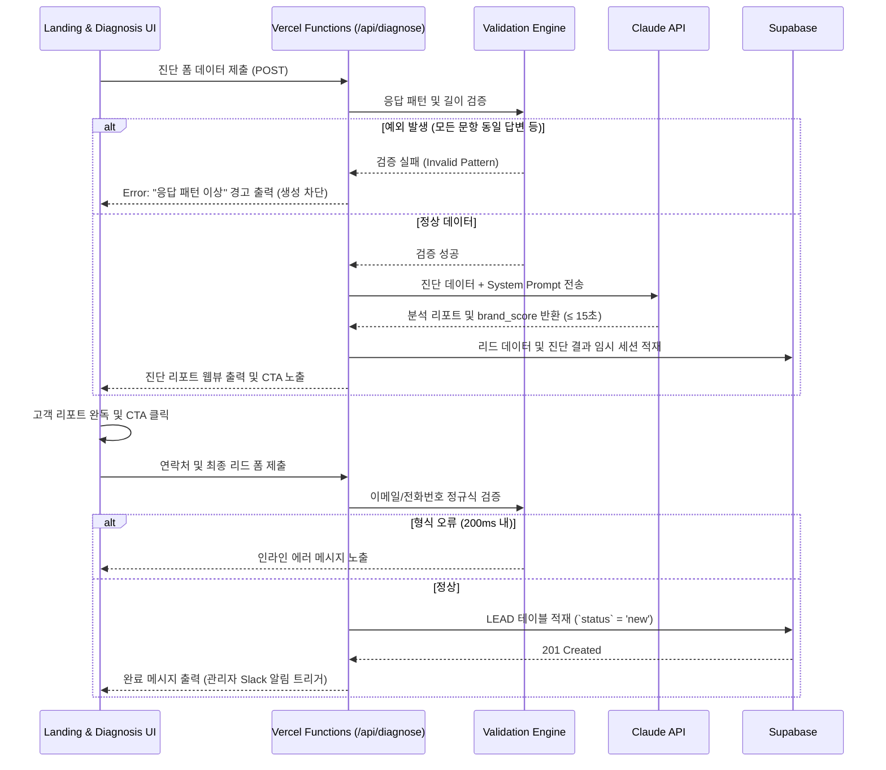

## 1. Introduction

### 1.1 Purpose
본 Software Requirements Specification(SRS) 문서는 5060 프리미엄 브랜드 매니지먼트 시스템의 기능적, 비기능적 요구사항을 정의한다. 본 시스템은 5060 고경력 전문가(퇴직/전환기 임원, 연구원, 전문직 등)의 암묵지를 42문항 인터뷰와 AI(Claude API)를 통해 추출하여, B2B 제안서 및 강의안 형태의 구체적인 자산으로 자동 변환하는 100% 대행(Done-for-you) 매니지먼트 플랫폼이다. 이 시스템은 사용자가 디지털 도구 조작 없이 강연 및 자문 수익을 창출할 수 있도록 돕는 것을 핵심 목적으로 한다.

### 1.2 Scope
본 시스템의 릴리스(MVP V1) 범위는 다음과 같이 정의된다.

**In-Scope (포함 범위):**
* **F2:** AI 브랜드 진단 툴 (웹 기반, 5~10문항 진단 및 리포트 즉시 출력)
* **F1, F3:** AI 마스터 브리프 생성기 및 관리자 콘솔 (인터뷰 텍스트 입력 및 AI 기반 15p 브리프 자동 생성, 검수 UI)
* **F4:** 리드 DB 및 CRM 자동 적재 (Supabase 기반 리드 트래킹)
* 랜딩페이지 및 진단 결과 리포트 웹뷰 구현

**Out-of-Scope (제외 범위 - V1 기준):**
* **F8:** PPT 디자인 자동 Export (A급 에이전시 수동 외주로 대체)
* **F7:** STT(Speech-to-Text) 연동 (운영자 수동 녹취로 대체)
* 결제 시스템 연동 (수동 계좌이체로 대체)
* SNS 회원가입 / OAuth 로그인
* **F5:** 고객 셀프서비스 진척도 대시보드 (V2 예정)
* **F6:** 리테이너 구독 자동 결제 (V2 예정)
* 모바일 네이티브 앱 및 고도화된 모션/애니메이션

### 1.3 Definitions, Acronyms, Abbreviations
* **JTBD (Jobs To Be Done):** 고객이 특정 상황에서 달성하고자 하는 근본적인 과업이나 목적.
* **AOS (Adjusted Opportunity Score):** 조정된 기회 점수로, 타깃 시장 내 특정 Pain point 해결에 대한 잠재적 시장 가치.
* **DOS (Discovered Opportunity Score):** 발견된 기회 점수.
* **MVP (Minimum Viable Product):** 최소 기능 제품 (V1 릴리스).
* **Validator:** 결과물의 적합성과 품질을 평가하는 주체 또는 기준 (본 시스템에서는 운영자 검수 및 C-Level 적합성 평가).
* **NPS (Net Promoter Score):** 순수 추천 고객 지수.

### 1.4 References
* **[REF-01]** Value Proposition Sheet_2026.md (통합 완성본)
* **[REF-02]** PRD_Quality_Review_v0.1.md
* **[REF-03]** 1_competents-analysis.md (경쟁사 분석)
* **[REF-04]** 2_porters-foreces.md (Porter's 5 Forces)
* **[REF-05]** 3_value-chain.md (가치사슬 분석)
* **[REF-06]** 4_ksf-report.md (KSF 보고서)
* **[REF-07]** 5_problem-definition.md (문제정의서)
* **[REF-08]** 6_TAM-SAM-SOM+MarketSegmentMap.md
* **[REF-09]** 7_persona-spectrum-map.md (페르소나 스펙트럼)
* **[REF-10]** 8_customer-journey-map.md (CJM)
* **[REF-11]** 9_aos-dos-analysis.md & 10_jtbd-interview-report.md

### 1.5 Constraints and Assumptions
* **Assumptions:**
    * Claude API의 200K 토큰 윈도우는 42문항 인터뷰 전문 처리에 충분하다.
    * Vercel Hobby + Supabase Free 티어는 MVP 단계(월 리드 50건, 프로젝트 6건)의 트래픽을 처리 가능하다.
* **Constraints (Risks & ADR):**
    * API 비용 제약: 월 API 비용이 $100 도달 시 자동으로 호출을 중단하고 수동 승인 체제로 전환해야 한다.
    * 보안 제약: 시스템 저장 데이터는 AES-256, 전송 구간은 TLS 1.3으로 암호화해야 한다.
    * 운영 제약: 모든 AI 브리프는 클라이언트 납품 전 반드시 관리자(운영자)의 수동 검수를 거쳐야 한다.

-------------------------------------------------
## 2. Stakeholders

| Role | Responsibility | Interest | 대상 페르소나 매핑 (PRD) |
| :--- | :--- | :--- | :--- |
| **End-User (고객)** | 진단 폼 응답, 인터뷰 참여, 최종 산출물(제안서/강의안) 수령 및 B2B 시장 활용 | 디지털 도구 노동 없이 자신의 경력을 고수익 자산으로 변환하는 것 | 김명진(55, 전 임원), 정재호(59, 영업본부장), 박태현(58, 수석연구원) 등 Core/Adj 페르소나 |
| **Admin (운영자/대표)** | 인터뷰 진행(오프라인/화상), 콘솔을 통한 AI 변환 지시, 결과물 검수, 디자인 외주 오케스트레이션 | 최소한의 공수로 고품질 브리프를 생성하여 납품 병목을 해소하고 마진율(>40%)을 방어하는 것 | 브랜드 매니지먼트 사업부 대표 |
| **System (AI Ops)** | 입력된 텍스트 및 프롬프트에 기반하여 리포트 및 브리프 초안을 정해진 규칙과 성능 내에 자동 생성 | 시스템 안정성 유지, 환각(Hallucination) 최소화, 정해진 예산 한도 내 API 호출 | Claude API, Vercel Functions |

-------------------------------------------------
## 3. System Context and Interfaces

### 3.1 External Systems
* **Claude API (Anthropic):** 핵심 AI 생성 엔진. 인터뷰 텍스트를 마스터 브리프로, 진단 폼 데이터를 진단 리포트로 변환.
* **Google Analytics 4 (GA4):** 랜딩페이지 유입, 진단 폼 완료율, 이벤트(CTA 클릭) 등을 트래킹.

### 3.2 Client Applications
* **랜딩페이지 및 웹 진단 툴 (Web Client):** 잠재 고객이 접근하여 AI 브랜딩 진단을 수행하고 리포트를 확인하는 프론트엔드 환경.
* **관리자 콘솔 (Admin Web):** 운영자가 접근 권한을 획득하여 프로젝트, 리드, AI 브리프 생성을 관리하는 대시보드.

### 3.3 API Overview
* **내부 API (Vercel Serverless Functions):**
    * `/api/diagnose` (POST): 사용자 진단 데이터 제출 및 AI 리포트 반환
    * `/api/generate-brief` (POST): 인터뷰 Raw 텍스트 전송 및 브리프 데이터 스트리밍 수신
* **데이터 API (Supabase REST API):**
    * 리드, 진단 결과, 프로젝트 상태 등의 CRUD 작업을 위한 REST형 인터페이스 (Row Level Security 적용).

### 3.4 Interaction Sequences
본 섹션은 시스템의 핵심 가치인 '마스터 브리프 생성 및 납품'의 전반적인 시퀀스를 나타낸다.

-------------------------------------------------
## 4. Specific Requirements

### 4.1 Functional Requirements

| ID | Feature (PRD) | Priority | Source (Story) | Requirement Description | Acceptance Criteria (AC) |
| :--- | :--- | :--- | :--- | :--- | :--- |
| **REQ-FUNC-101** | F1. AI 마스터 브리프 생성기 | Must | Story 1, 4 | 시스템은 관리자가 입력한 42문항 인터뷰 텍스트를 바탕으로 Claude API를 호출하여 15p 분량의 마스터 브리프 초안을 생성해야 한다. | Given: 42문항 인터뷰 완료 상태. When: 브리프 생성 요청 시. Then: 15p 분량 초안 자동 생성 (소요시간 ≤ 30분). |
| **REQ-FUNC-102** | F1. AI 마스터 브리프 생성기 | Must | Story 1 | 시스템은 입력된 인터뷰 응답이 20문항 미만일 경우 AI 브리프 생성을 원천 차단해야 한다. | Given: 20문항 미만 응답. When: 생성 요청 시. Then: "응답 부족" 경고 출력 및 생성 차단 (정확도 100%). |
| **REQ-FUNC-103** | F3. 관리자 콘솔 | Must | Story 1 | 시스템은 관리자가 브리프 초안을 수정하고 저장할 때마다 이력을 버전 단위(`briefs.version`)로 기록해야 한다. | Given: 주요 수정 요청 발생. When: 수정본 등록 시. Then: `briefs.version`에 이력 기록 (수정 납품 5영업일 이내). |
| **REQ-FUNC-201** | F3. 관리자 콘솔 | Must | Story 2 | 시스템은 구술 기반의 녹취 텍스트(최소 1,000자 이상) 입력 시, 이를 논리적 구조의 B2B 제안 카피로 변환해야 한다. | Given: 녹음 텍스트 전달 완료. When: 콘솔 입력 시. Then: B2B 카피 자동 변환 (핵심 메시지 반영률 ≥ 90%). |
| **REQ-FUNC-202** | F3. 관리자 콘솔 | Must | Story 2 | 시스템은 텍스트가 500자 이하일 경우 생성을 차단하고 오류 메시지를 반환해야 한다. | Given: 500자 이하 텍스트 입력. When: 콘솔 입력 시. Then: "입력 부족 - 최소 1000자 이상 필요" 경고 출력. |
| **REQ-FUNC-301** | F2. AI 브랜드 진단 툴 | Must | Story 3 | 시스템은 웹 기반 진단 폼(5~10문항) 제출 시, 즉시 브랜드 지수 및 약점 분석 리포트를 생성하여 출력해야 한다. | Given: 5문항 폼 완료. When: 제출 시. Then: 리포트 즉시 출력 (생성 시간 ≤ 10초). |
| **REQ-FUNC-302** | F2. AI 브랜드 진단 툴 | Must | Story 3 | 시스템은 모든 문항에 동일한 선택지를 고른 불성실 응답 패턴을 감지하고 리포트 생성을 차단해야 한다. | Given: 모든 문항 동일 선택. When: 제출 시. Then: "응답 패턴 이상" 메시지 출력 (오차단율 < 2%). |
| **REQ-FUNC-303** | F4. 리드 DB (Supabase) | Must | Story 3 | 시스템은 리포트 하단의 상담 신청 폼 제출 시 리드 정보를 즉시 데이터베이스에 적재해야 한다. | Given: 상담 폼 제출. When: 클릭 시. Then: Supabase DB 저장 (성공률 ≥ 99.5%). |
| **REQ-FUNC-304** | F2. AI 브랜드 진단 툴 | Must | Story 3 | 시스템은 상담 신청 폼 내 이메일 형식 오류나 필수값 누락을 클라이언트 단에서 즉시 검증해야 한다. | Given: 이메일 오류/연락처 누락. When: 제출 시. Then: 인라인 에러 메시지 200ms 내 노출 및 DB 저장 0건 처리. |
| **REQ-FUNC-401** | F1. AI 마스터 브리프 생성기 | Must | Story 4 | 시스템은 인터뷰 데이터에서 가치선언문, 핵심 타깃, 강의 주제 3종을 자동 추출해야 한다. | Given: 인터뷰 데이터 입력. When: 엔진 처리 시. Then: 3종 요소 자동 도출 (고객 동의율 목표 ≥ 85%). |
| **REQ-FUNC-402** | F6. 리테이너 관리 | Should | Story 4 (연장) | 시스템은 옵션 B 완료 고객을 대상으로 월정액(리테이너) 관리 이력을 데이터베이스에 저장할 수 있어야 한다. (V1 백엔드 구조 지원) | Given: 리테이너 계약 완료. When: 상태 갱신 시. Then: `retainers` 엔터티에 상태 반영. |

### 4.2 Non-Functional Requirements

| ID | Category | Requirement Description | Target Metrics / SLA |
| :--- | :--- | :--- | :--- |
| **REQ-NF-001** | Performance | 진단 리포트 생성 시 사용자 응답 지연을 최소화해야 한다. | p95 응답 시간 **≤ 15초** |
| **REQ-NF-002** | Performance | 마스터 브리프 생성 시 시스템 과부하를 방지하고 일정 시간 내 처리해야 한다. | p95 응답 시간 **≤ 10분** (15p 분량 기준) |
| **REQ-NF-003** | Performance | 랜딩페이지 접속 시 초기 로딩 속도를 최적화해야 한다. | LCP(초기 로딩) **≤ 2.5초** |
| **REQ-NF-004** | Availability | 클라우드 인프라(Vercel, Supabase)의 가용성을 유지해야 한다. | 월 가용성 **≥ 99.0%** (서버 오류율 5xx ≤ 1.0%) |
| **REQ-NF-005** | Security | 고객 인터뷰 데이터 및 개인정보는 암호화 처리되어야 한다. | 저장 시 **AES-256**, 전송 시 **TLS 1.3** |
| **REQ-NF-006** | Security | 시스템 접근 및 권한 관리 시 하드코딩된 키나 취약점이 없어야 한다. | 하드코딩 키 **0건**, 분기 1회 스캔 XSS/SQLi 취약점 **0건** |
| **REQ-NF-007** | Cost Constraint | 시스템 운영 비용을 통제하기 위해 API 호출 임계치를 적용해야 한다. | Claude API 비용 월 **$100 도달 시 자동 중단** 및 알림 발송 |
| **REQ-NF-008** | Quality/Accuracy | AI 브리프 생성 시 발생할 수 있는 환각(Hallucination) 문장의 비율을 제한해야 한다. | 수동 검수 기준 환각율 **< 5%** (월간 환각율 10% 초과 시 프롬프트 튜닝 트리거) |
| **REQ-NF-009** | Business KPI | 고객의 디지털 노동(도구 조작, 타이핑 등)을 철저히 배제해야 한다. | 고객 개입률 **0%**, 직접 노동 시간 **0시간** |
| **REQ-NF-010** | Usability / Data | 시스템은 데이터 손실 방지를 위해 정기 백업을 수행해야 한다. | DB 백업 일 **1회** 자동 실행 |

-------------------------------------------------
## 5. Traceability Matrix

| Source (User Story) | Requirement ID | Feature/Component | Test Case ID (예상) |
| :--- | :--- | :--- | :--- |
| Story 1 (B2B 무기 확보) | REQ-FUNC-101 | F1. 브리프 생성기 | TC-101-BriefGen |
| Story 1 (B2B 무기 확보) | REQ-FUNC-102 | F1. 브리프 생성기 | TC-102-BlockInvalidData |
| Story 1 (B2B 무기 확보) | REQ-FUNC-103 | F3. 관리자 콘솔 | TC-103-VersionControl |
| Story 2 (노동 해방) | REQ-FUNC-201 | F3. 관리자 콘솔 | TC-201-SpeechToCopy |
| Story 2 (노동 해방) | REQ-FUNC-202 | F3. 관리자 콘솔 | TC-202-LengthValidation |
| Story 3 (리드 확보/진단) | REQ-FUNC-301 | F2. 진단 툴 | TC-301-DiagnosisReport |
| Story 3 (리드 확보/진단) | REQ-FUNC-302 | F2. 진단 툴 | TC-302-PatternValidation |
| Story 3 (리드 확보/진단) | REQ-FUNC-303 | F4. 리드 DB | TC-303-LeadSave |
| Story 3 (리드 확보/진단) | REQ-FUNC-304 | F2. 진단 툴 | TC-304-FormValidation |
| Story 4 (자기 객관화) | REQ-FUNC-401 | F1. 브리프 생성기 | TC-401-ExtractValues |
| Story 4 (자기 객관화) | REQ-FUNC-402 | F6. 리테이너 관리 | TC-402-RetainerUpdate |

-------------------------------------------------
## 6. Appendix

### 6.1 API Endpoint List

| Method | Endpoint | Description | Input Params/Body | Output/Response | Rate Limit |
| :--- | :--- | :--- | :--- | :--- | :--- |
| POST | `/api/diagnose` | 진단 폼 제출 및 리포트 반환 | `{"answers": [1, 2, 3, 4, 5], "lead_id": "uuid"}` | `{"brand_score": 85, "report": "..."}` | 50 req/hr (User) |
| POST | `/api/generate-brief` | 마스터 브리프 초안 생성 | `{"project_id": "uuid", "raw_text": "..."}` | `{"status": "streaming", "content": "..."}` | 50 req/min (Global) |
| GET | `/api/leads` | 확보된 리드 목록 조회 (Admin) | Header: `Auth-Token` | `[{"id": "...", "name": "..."}]` | DB Limit |
| POST | `/api/leads` | 신규 리드 데이터 DB 적재 | `{"name": "...", "phone": "...", "email": "..."}` | `201 Created` | DB Limit |
| POST | `/api/briefs/version` | 검수된 브리프 버전 저장 | `{"brief_id": "uuid", "reviewed_output": "...", "version": 2}`| `200 OK` | DB Limit |

### 6.2 Entity & Data Model

| Entity Name | Primary Key | Attributes / Data Type | Description (Constraints) |
| :--- | :--- | :--- | :--- |
| **LEAD** | `id` (uuid) | `name` (string), `phone` (string), `email` (string), `title` (string), `company` (string), `channel` (string), `created_at` (timestamp), `status` (enum) | `status` 필드는 [new, contacted, converted, lost] 상태 관리. |
| **DIAGNOSIS** | `id` (uuid) | `lead_id` (FK), `answers` (jsonb), `report` (jsonb), `brand_score` (float), `created_at` (timestamp) | 리드의 진단 결과 데이터. `lead_id`에 매핑. |
| **CLIENT** | `id` (uuid) | `lead_id` (FK), `name` (string), `package` (enum), `paid_amount` (int), `contract_date` (date) | 전환된 실제 결제 고객. `package`는 [option_a, option_b]로 구성. |
| **PROJECT** | `id` (uuid) | `client_id` (FK), `status` (enum), `target_delivery` (date), `actual_delivery` (date) | 프로젝트 워크플로우 추적. `status`는 [interview, brief, asset, review, delivered]. |
| **BRIEF** | `id` (uuid) | `project_id` (FK), `raw_input` (text), `ai_output` (jsonb), `reviewed_output` (text), `version` (int), `created_at` (timestamp) | AI 생성 및 검수된 브리프 이력. |
| **RETAINER** | `id` (uuid) | `client_id` (FK), `monthly_fee` (int), `start_date` (date), `end_date` (date), `status` (enum) | 옵션 B 이후 월정액 고객 관리. `status`는 [active, paused, cancelled]. |

### 6.3 Detailed Interaction Models

다음 시퀀스 다이어그램은 잠재 고객의 진단 리드 발생부터 시스템 예외 처리(불성실 응답 차단)까지의 상세 흐름을 나타낸다.

## 7. Validation & Experiment Plan
본 섹션은 PRD의 실험 설계 및 성공 기준을 바탕으로, 요구사항이 비즈니스 목표를 충족하는지 검증하기 위한 상세 계획을 기술한다.

### 7.1 실험 가설 및 검증 설계 (E1~E4)

| ID | 실험 가설 | 검증 설계 (Design) | 측정 지표 및 도구 | 성공 기준 (Success) | 중단 기준 (Kill-criteria) |
| :--- | :--- | :--- | :--- | :--- | :--- |
| **VAL-EXP-001** | AI 프롬프트의 VVIP 수준 브리프 생성 능력 | 파일럿 테스트 (n=3). 실제 데이터 주입 후 AI vs 수동 기획 블라인드 비교 | 외부 전문가 3인 평가 (5점 척도), 고객 NPS | 평균 점수 ≥ 3.5/5.0, 수동 대비 차이 ≤ 0.5 | 평균 < 2.5 시 프롬프트 아키텍처 전면 재설계 |
| **VAL-EXP-002** | 5문항 AI 진단의 상담 전환 유도 효과 | A/B 테스트 (n=100). A: 리포트→CTA vs B: 즉시 상담 CTA | GA4 (폼 완료율, CTA 클릭율), Fisher's Exact Test | A 그룹 전환율이 B 대비 ≥ 2배 (p < 0.05) | p ≥ 0.20 이고 A ≤ B 시 진단 퍼널 폐기 |
| **VAL-EXP-003** | 고가 옵션(Option B)의 가격 앵커링 효과 | 상담 시 두 옵션(650만/880만) 동시 노출 및 선택 비율 추적 (n=30) | Supabase `clients.package` 결제 로그, 상담 녹취 분석 | Option B 선택 비율 ≥ 60% | Option B < 30% 시 가격 구조 및 단계 재설계 |
| **VAL-EXP-004** | 서비스 완료 고객의 실제 B2B 수주 실현 | 종단 추적 (n=3, 3개월). 플랫폼 게시 후 수주 실적 월별 추적 | Typeform 자가 보고, 플랫폼 조회수/컨택수 스크린샷 | 3명 중 ≥ 2명이 3개월 내 유료 수주 달성 | 0명 수주 시 산출물 품질 및 페르소나 재검증 |

-------------------------------------------------

## 8. Risk Management & Constraints
시스템 구현 및 운영 과정에서 발생 가능한 리스크와 기술적 제약사항을 관리한다.

### 8.1 리스크 매트릭스 및 대응 전략

| ID | 리스크 항목 | 발생 확률 | 영향도 | 대응 전략 (Mitigation) | 트리거 임계치 |
| :--- | :--- | :---: | :---: | :--- | :--- |
| **RSK-001** | AI 환각 및 저품질 템플릿 반환 | 중-높 | 상 | 모든 브리프는 운영자 수동 검수 후 납품. 시스템 프롬프트에 기획 철학 이식 | 월간 환각율 > 10% 시 프롬프트 리팩토링 Sprint |
| **RSK-002** | 1인 운영 병목 (확장 한계) | 높음 | 상 | 대표 역할을 최종 검수자로 한정. AI 자동화 극대화. 월 6건 상한제 운영 | 7건째 문의 시 예약제 전환, 대기 3건 시 인력 온보딩 |
| **RSK-003** | VVIP 고객의 디지털 도구/타이핑 거부 | 중간 | 중 | 진단 폼 객관식 90% 구성. 코어 인터뷰 100% 대면/화상 녹음 진행 | 폼 이탈율 > 50% 시 문항 수 축소 (5→3개) |
| **RSK-004** | Claude API 가격 변동 및 장애 | 중-낮 | 중 | 대체 LLM(GPT-4o 등) 프롬프트 호환 테스트 완료. 월 비용 하드캡($100) 설정 | 가격 20% 인상 시 대체 모델 전환 검토 (72시간 내) |
| **RSK-005** | 타깃 시장 규모 및 지불 의향 과추정 | 낮음 | 상 | 1~3개월 내 실제 파일럿 수주로 PoC 확보. Before/After 포트폴리오 구축 | 파일럿 3명 중 0명 결제 시 가격 구조 전면 재설계 |

-------------------------------------------------

## 9. Proof & Rationale
본 SRS에 기술된 요구사항의 비즈니스적 근거와 타당성을 증명하는 데이터 맵이다.

### 9.1 요구사항 근거 매트릭스

| # | 핵심 주장 및 요구사항 | 근거 유형 | 검증 방법론 | 성공 기준 | 원천 문서 (REF) |
| :---: | :--- | :--- | :--- | :--- | :--- |
| **1** | 880만 원 가격 책정의 타당성 | JTBD 인터뷰 | 파일럿 고객 실제 결제 전환율 측정 | 3명 중 ≥ 2명 결제 | REF-11, REF-01 |
| **2** | AI 브리프 품질 신뢰도 | 프롬프트 프로토타입 | 전문가 블라인드 비교 평가 (E1) | 평균 점수 ≥ 3.5/5.0 | 프롬프트 로그 |
| **3** | 진단 툴의 리드 확보 효용성 | 가설 페이지 테스트 | 리드 전환율 A/B 테스트 (E2) | A 그룹 전환율 > B × 2 | REF-01, GA4 |
| **4** | SOM 1,300억 시장 규모 | 시장 추산 | 파일럿 전환율 기반 역산 공식 적용 | 역산 SOM ≥ 500억 | REF-08 |
| **5** | 경쟁사 대비 차별화 (산출물 중심) | 경쟁사 분석 | 이탈자 인터뷰 및 Switch 사유 분석 | "산출물 부재" 사유 ≥ 60% | REF-03, REF-04 |
| **6** | 42문항 인터뷰의 무기 추출 능력 | AOS-DOS 분석 | 파일럿 내 핵심 메시지 반영률 측정 | 고객 동의율 ≥ 85% | REF-11, REF-09 |
| **7** | 수익률(46~60%) 방어 가능성 | 수익 시뮬레이션 | 실제 원가(API+디자인+운영) 추적 | 순이익률 ≥ 40% | REF-01 (§4) |

-------------------------------------------------

## 10. Project Schedule & Roadmap
요구사항 구현을 위한 단계별 이행 로드맵이다.

### 10.1 단계별 이행 계획
1.  **Phase 0 (준비):** 프롬프트 엔지니어링 Core 엔진 구축, 랜딩페이지 및 진단 폼 개발, 디자인 에이전시 시범 계약.
2.  **Phase 1 (클로즈드 베타):** 파일럿 고객 2~3명 섭외 및 실제 42문항 인터뷰 수행, AI 품질 튜닝, 초도 물량 납품.
3.  **Phase 2 (오픈 베타):** 진단 툴 퍼블릭 런칭, 리드 퍼널 A/B 테스트, 운영 케파 확장(월 3→6건).
4.  **Phase 3 (정식 런칭):** 가격 구조 최종 확정, 리테이너 모델 도입, 자동 결제 및 대시보드 인프라 구축(V2).

-------------------------------------------------