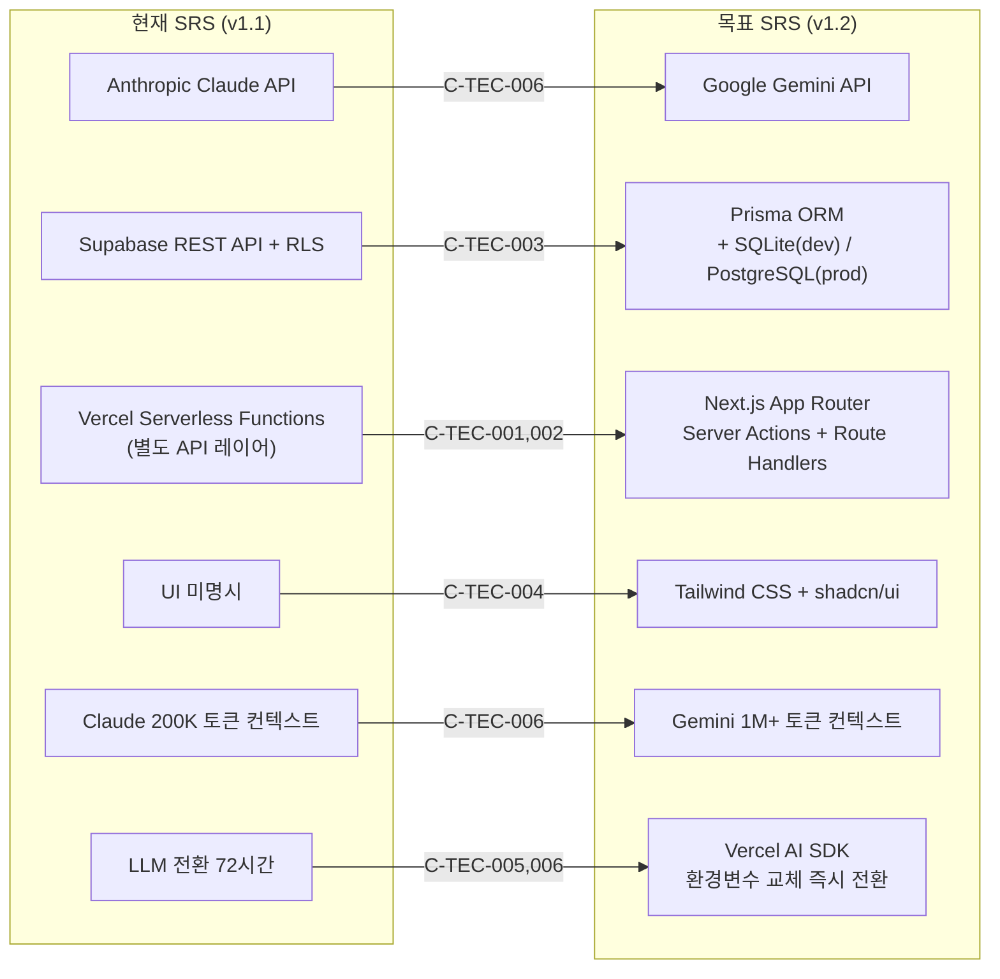
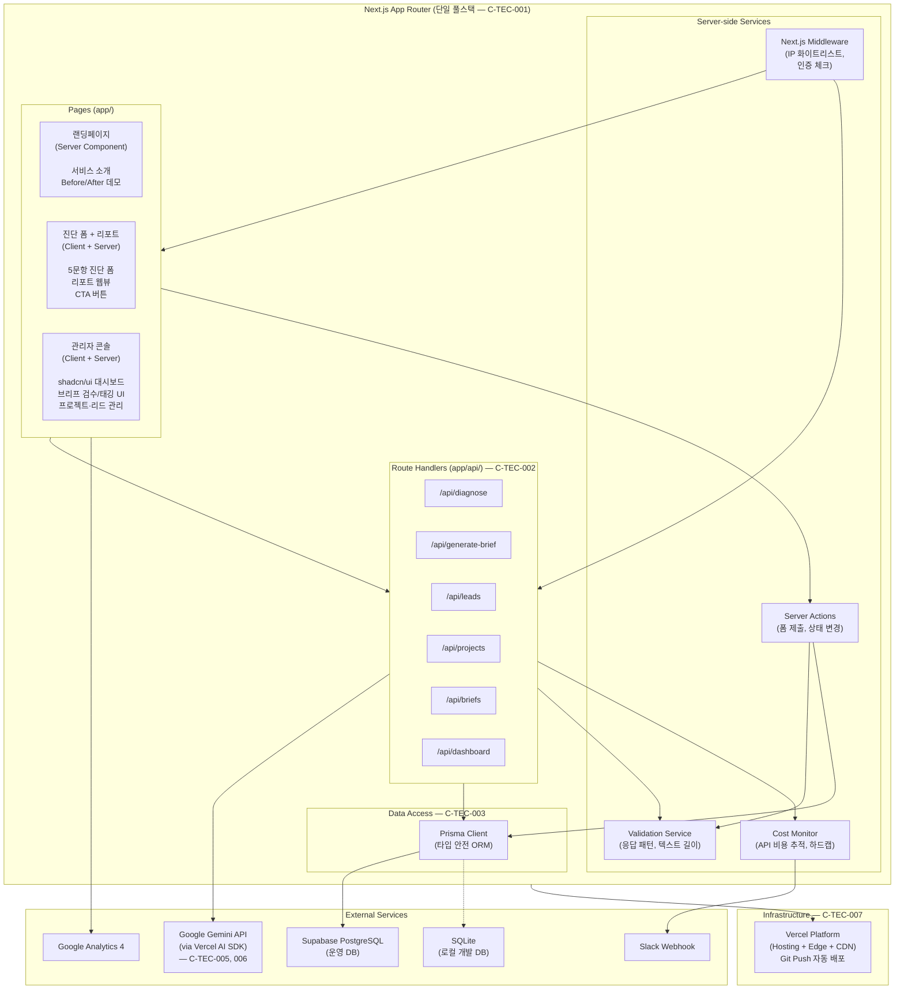

# SRS 기술 스택 마이그레이션 계획서

| 항목 | 내용 |
| :--- | :--- |
| **대상 문서** | `SRS-Drafts/SRS_v0_1_Opus.md` |
| **현재 버전** | SRS-001 v1.1 |
| **목표 버전** | SRS-001 v1.2 (Tech Stack Aligned) |
| **작성일** | 2026-04-21 |
| **목적** | C-TEC-001~007 기술 스택을 SRS 전문에 전면 반영하되, MVP 핵심 가치 전달이 훼손되지 않음을 보장 |

---

## 1. 변경 근거 — C-TEC 기술 스택 명세

> 아래 7개 기술 제약은 SRS 내 모든 아키텍처·인터페이스·비기능 요구사항의 **상위 강제 조건**으로 작용한다.

| ID | 제약 | 핵심 키워드 |
| :--- | :--- | :--- |
| **C-TEC-001** | 모든 서비스는 **Next.js (App Router)** 기반의 단일 풀스택 프레임워크로 구현한다. (프론트엔드/백엔드 분리 금지) | App Router, 단일 풀스택 |
| **C-TEC-002** | 서버 측 로직은 **Server Actions 또는 Route Handlers**를 사용하여 별도의 백엔드 서버 없이 구현한다. | Server Actions, Route Handlers |
| **C-TEC-003** | DB는 **Prisma + 로컬 SQLite**(개발) / **Supabase PostgreSQL**(운영)으로 구성한다. | Prisma ORM, SQLite, PostgreSQL |
| **C-TEC-004** | UI는 **Tailwind CSS + shadcn/ui**를 사용한다. | Tailwind, shadcn/ui |
| **C-TEC-005** | LLM 오케스트레이션은 **Vercel AI SDK**를 사용하여 Next.js 내부에서 직접 구현한다. | Vercel AI SDK |
| **C-TEC-006** | LLM은 **Google Gemini API**를 기본으로 사용하며, 환경 변수 설정만으로 모델 교체가 가능하도록 한다. | Gemini API, 모델 교체 가능 |
| **C-TEC-007** | 배포는 **Vercel** 플랫폼으로 단일화하며, Git Push만으로 자동 배포한다. | Vercel, Git Push 배포 |

---

## 2. 현재 SRS ↔ 목표 스택 갭 분석

### 2.1 핵심 변경 맵



### 2.2 변경 강도별 분류

| 강도 | 영역 | 설명 |
| :---: | :--- | :--- |
| 🔴 **대** | AI 엔진 (Claude → Gemini) | SRS 전체에 걸친 AI 모델명·가격·제약 변경. 시퀀스 다이어그램 6개의 participant 변경 포함 |
| 🔴 **대** | DB 접근 계층 (REST API + RLS → Prisma ORM) | 보안 모델 근본 변경 (RLS → App-level Middleware). 데이터 모델 §6.2는 Prisma schema로 재해석 |
| 🟡 **중** | 프레임워크 아키텍처 (Serverless → App Router 통합) | §3.6 Component Diagram 전면 재작성. API 엔드포인트는 Route Handlers로 유지되나 아키텍처 모델 변경 |
| 🟡 **중** | LLM 전환 전략 | REQ-NF-022의 "72시간" → "즉시 전환"으로 개선. 추상화 계층 명시 |
| 🟢 **소** | UI 스택 (미명시 → Tailwind + shadcn/ui) | Constraints 섹션에 추가 기재. 기능 요구사항에 영향 없음 |
| 🟢 **소** | 배포 전략 | Git Push 자동 배포 명시. 기존 Vercel 사용과 호환 |

---

## 3. 섹션별 변경 명세 (11개)

### Change-01: §1.2.3 Constraints — 기술 제약 전면 교체

| 변경 행 | Before | After |
| :--- | :--- | :--- |
| `CON-05` | Claude API 200K 토큰 컨텍스트 윈도우 제약 | **Gemini API 1M+ 토큰 컨텍스트 윈도우** (42문항 인터뷰 전문 + 프롬프트 패턴 168개를 단일 호출로 처리 가능) |
| `CON-07` | ADR: Next.js + Vercel Serverless + Supabase 스택 고정 | ADR: **Next.js App Router + Prisma ORM + Vercel AI SDK + Gemini API** 스택 고정 (C-TEC-001~007 준수) |
| 신규 `CON-08` | — | **Prisma datasource 전환**: 로컬 개발은 `SQLite`, 운영 배포는 `Supabase PostgreSQL`로 `schema.prisma`의 datasource만 교체 (C-TEC-003) |
| 신규 `CON-09` | — | **UI 프레임워크 고정**: Tailwind CSS + shadcn/ui 사용 강제. AI 코드 생성 일관성 보장 (C-TEC-004) |

---

### Change-02: §1.2.4 Assumptions — 가정 업데이트

| 변경 행 | Before | After |
| :--- | :--- | :--- |
| `ASM-02` | Claude API 200K 토큰이 42문항 처리에 충분 | **Gemini API 1M+ 토큰 컨텍스트**가 42문항 인터뷰 전체 텍스트 + 168개 프롬프트 패턴 처리에 충분 |
| 신규 `ASM-05` | — | Prisma ORM이 SQLite(로컬)와 PostgreSQL(운영) 간 **스키마 호환성**을 완전히 보장하며, 마이그레이션 스크립트(`prisma migrate`)로 양방향 전환 가능 |
| 신규 `ASM-06` | — | Vercel AI SDK의 표준 인터페이스(`generateText`, `streamText`)가 Gemini/Claude/GPT-4o 간 **동일한 호출 시그니처**를 제공하여 모델 교체 시 비즈니스 로직 수정 불필요 |

---

### Change-03: §1.3 Definitions — 신규 용어 추가

| 용어 | 정의 |
| :--- | :--- |
| **App Router** | Next.js 13+의 라우팅 아키텍처. `app/` 디렉토리 기반으로 서버/클라이언트 컴포넌트를 구분하고, Layout/Page/Loading/Error 패턴을 표준화 |
| **Server Actions** | Next.js App Router에서 클라이언트 폼 제출 등을 서버 측 함수로 직접 처리하는 RPC 패턴. 별도 API 엔드포인트 없이 DB 접근 가능 |
| **Route Handlers** | Next.js App Router에서 `app/api/*/route.ts` 파일로 정의하는 HTTP 엔드포인트. 기존 API Routes의 후속 |
| **Prisma ORM** | TypeScript 기반 ORM. 스키마 파일(`schema.prisma`)로 모델을 선언하고, 타입 안전한 쿼리 클라이언트를 자동 생성 |
| **Vercel AI SDK** | Vercel이 제공하는 AI 앱 개발 프레임워크. `ai` 패키지를 통해 LLM 호출, 스트리밍, 도구 사용을 표준화 |
| **shadcn/ui** | Radix UI 기반의 복사-붙여넣기 컴포넌트 라이브러리. Tailwind CSS로 스타일링되며, 프로젝트 내에 소스 코드로 존재 |
| **RLS → App-level Auth** | 기존 Supabase RLS(행 단위 보안)을 대체하는 방식. Next.js Middleware + Prisma 쿼리 필터로 접근 제어를 애플리케이션 계층에서 구현 |

---

### Change-04: §3.1 External Systems — AI 엔진 교체 + Fallback 갱신

| 변경 | Before | After |
| :--- | :--- | :--- |
| `EXT-01` 시스템명 | Anthropic Claude API | **Google Gemini API** |
| 통신 프로토콜 | HTTPS (TLS 1.3) | HTTPS (TLS 1.3) — 변경 없음 |
| 제약 | Rate: 50 req/min, Context: 200K, Cost: ~$0.015/1K | Rate: RPM/TPM Tier 기반, Context: **1M+ tokens**, Cost: Flash ~$0.075/1M input |
| 장애 우회 | 캐싱된 샘플 리포트 템플릿 반환 | 동일 전략 유지 + Vercel AI SDK의 **provider 자동 전환** (Gemini → Claude fallback) 로직 추가 가능 |
| `EXT-02` Supabase 역할 | 리드 DB + REST API + RLS 접근 제어 | 리드 DB (PostgreSQL) + Storage. **DB 접근은 Prisma ORM 경유**. RLS 대신 App-level 접근 제어 |

---

### Change-05: §3.3 API Overview — Route Handlers 명시

변경 내용:
- 테이블 상단에 **구현 방식 주석** 추가: *"아래 API는 Next.js App Router의 Route Handlers(`app/api/*/route.ts`)로 구현하며, 일부 admin 내부 호출은 Server Actions으로 대체 가능하다."*
- `Claude API` 참조 → `Gemini API (via Vercel AI SDK)` 로 치환
- `Supabase` 참조 → `Prisma ORM → Supabase PostgreSQL` 로 치환

---

### Change-06: §3.6 Component Diagram — 전면 재작성

**Before**: Client Layer → API Layer (Serverless) → External Services (3계층 분리)  
**After**: Next.js App Router 단일 풀스택 내에서 Client Components / Server Components / Route Handlers / Server Actions가 통합된 아키텍처



---

### Change-07: §3.7 Class Diagram — 서비스 클래스 수정

| 클래스 | 변경 내용 |
| :--- | :--- |
| `BriefGenerator` | `claudeAPI` 의존 제거 → `vercelAI: VercelAIClient` 주입. `generateBrief()`는 `streamText()` 호출로 변경 |
| `DiagnosisValidator` | 변경 없음 (순수 검증 로직) |
| `CostMonitor` | Anthropic Dashboard 참조 → **Gemini API 사용량 추적** 로직으로 변경 |
| 신규 `PrismaService` | Prisma Client 싱글톤 관리, DB 연결 풀링, 트랜잭션 래퍼 |
| 신규 `AuthMiddleware` | Next.js Middleware 기반. IP 화이트리스트 + 세션 검증. Supabase RLS 대체 |

---

### Change-08: §4.1 Functional Requirements — AI 모델 참조 치환

본문 내 모든 `Claude API` 참조를 `AI 엔진(Gemini)` 또는 `Vercel AI SDK`로 치환한다.

| 대상 REQ | 현재 표현 | 변경 후 |
| :--- | :--- | :--- |
| REQ-FUNC-001 | "Claude API를 호출하여" | "Vercel AI SDK를 통해 Gemini API를 호출하여" |
| REQ-FUNC-002 | "Claude API로 전송된 상태" | "Vercel AI SDK의 `streamText()`로 전송된 상태" |
| REQ-FUNC-003 | "Claude API 호출이 발생하지 않는다" | "AI 엔진 호출이 발생하지 않는다" |
| REQ-FUNC-008 | "Claude API를 통해 브랜드 지수" | "Vercel AI SDK를 통해 Gemini API로 브랜드 지수" |
| REQ-FUNC-009 | "Claude API 호출 및 리포트 생성을 차단" | "AI 엔진 호출 및 리포트 생성을 차단" |
| REQ-FUNC-030 | "Claude API 장애 시" | "AI 엔진(Gemini API) 장애 시" |
| 그 외 ~9곳 | 동일 패턴 | 동일 방식 치환 |

---

### Change-09: §4.2 Non-Functional Requirements — 비용·성능·보안 갱신

| REQ-NF | 변경 내용 |
| :--- | :--- |
| **NF-001** (진단 p95 ≤ 15초) | 측정 기준에 "Gemini API 호출 포함" 명시. Gemini Flash 사용 시 응답속도 우위 예상 |
| **NF-010** (AES-256, TLS 1.3) | 유지. Supabase PostgreSQL 암호화 + Vercel TLS |
| **NF-012** (API Key 관리) | "Vercel Environment Variables" → "Vercel Environment Variables + **`.env.local` (로컬 개발)**" 추가 |
| **NF-013** (IP 화이트리스트) | "Supabase Auth 로그" → "**Next.js Middleware의 `req.ip` 검증 + Prisma 로그 테이블**" |
| **NF-015** (월 비용 $100) | Claude 가격 → **Gemini 가격 체계** 기준 재산출. Gemini 1.5 Flash: ~$0.075/1M input tokens → 동일 예산 내 **호출량 대폭 증가** |
| **NF-016** (비용 자동 중단) | "Anthropic Dashboard 연동" → "**Vercel AI SDK 호출 카운터 + Prisma 누적 비용 테이블** 기반 자동 중단" |
| **NF-022** (LLM 전환) | "72시간 이내 전환 가능하도록 AI 엔진과 비즈니스 로직 분리" → "**Vercel AI SDK 표준 인터페이스 + 환경변수(`AI_PROVIDER`, `AI_MODEL`) 교체만으로 즉시 전환 가능**. 비즈니스 로직 수정 불필요 (C-TEC-006)" |

---

### Change-10: §Sequence Diagrams (§3.4, §6.3) — participant 치환

6개 시퀀스 다이어그램 내 `Claude` participant를 `Gemini` 또는 `AI Engine`으로 일괄 치환한다.

| 다이어그램 | 위치 | 변경 |
| :--- | :--- | :--- |
| AI 브랜드 진단 플로우 | §3.4.1 | `participant Claude as Claude API` → `participant AI as Gemini API (via Vercel AI SDK)` |
| AI 마스터 브리프 생성 플로우 | §3.4.2 | 동일 |
| 리드 퍼널 전체 플로우 | §6.3.1 | 동일 |
| 브리프 생성→검수→납품 | §6.3.2 | 동일 |
| 비용 자동 차단 | §6.3.3 | `Anthropic Dashboard` → `Gemini Usage Tracker` |
| 모니터링 및 알림 | §6.3.4 | 변경 없음 (AI 무관) |

---

### Change-11: §6.2 Data Model — Prisma 컨텍스트 추가

기존 Entity 정의(6개)의 필드·타입·제약은 유지한다.

추가 변경:
- 섹션 서두에 **Prisma schema 매핑 안내** 추가: *"아래 엔터티는 `prisma/schema.prisma`로 정의되며, `prisma migrate`로 로컬 SQLite 및 운영 PostgreSQL에 자동 반영된다."*
- `RLS` 언급 → "**Prisma 쿼리 필터 + Next.js Middleware**로 접근 제어" 변경
- 신규 엔터티 `EVENT_LOG` 추가 (GA4 Fallback용)

| 필드명 | 타입 | 설명 |
| :--- | :--- | :--- |
| `id` | UUID, PK | 고유 식별자 |
| `event_type` | VARCHAR(50) | `page_view`, `cta_click`, `report_scroll_complete` 등 |
| `event_data` | JSONB | 이벤트 페이로드 |
| `user_agent` | VARCHAR(500) | 브라우저 정보 |
| `ip_hash` | VARCHAR(64) | 익명화된 IP 해시 |
| `created_at` | TIMESTAMP | 이벤트 발생 일시 |

---

## 4. MVP 핵심 사용자 경험 보호 검토

> **중요**: 기술 스택 변경이 "고객이 체감하는 가치"를 1%라도 훼손하는지 4개 핵심 여정별로 검증한다.

### 4.1 핵심 가치 여정 정의

PRD의 4개 User Story가 전달하는 핵심 경험:

| Journey | 핵심 가치 | 성공 기준 |
| :--- | :--- | :--- |
| **J1. 5문항 AI 진단 → 리포트** | "3분 만에 내 브랜드 약점을 객관적으로 알 수 있다" | 진단 폼 완료율 ≥ 60%, 리포트 생성 ≤ 10초 |
| **J2. 상담 신청 → 리드 등록** | "클릭 한 번으로 전문가 상담을 받을 수 있다" | 데이터 저장 성공률 ≥ 99.5%, 인라인 에러 ≤ 200ms |
| **J3. 42문항 인터뷰 → AI 브리프** | "말만 하면 15p 제안서 초안이 자동으로 나온다" | 브리프 생성 ≤ 30분, 실시간 스트리밍 확인 |
| **J4. 검수 → 에셋 납품** | "운영자가 검수하고 완성된 PDF를 받는다" | 버전 관리, 환각 태깅 기능 정상 작동 |

### 4.2 여정별 영향도 분석

#### J1. 5문항 AI 진단 → 리포트

```
[고객] → 랜딩페이지 → 진단 폼(5문항) → 제출 → AI 리포트 → CTA 클릭
```

| 체크포인트 | 기존 스택 | 변경 후 | 영향 |
| :--- | :--- | :--- | :---: |
| 랜딩페이지 로딩 (LCP ≤ 2.5s) | Next.js SSR | Next.js App Router **Server Component** (RSC) | ✅ **개선** — RSC가 번들 크기 감소, 초기 로딩 개선 |
| 진단 폼 UI | UI 미명시 | shadcn/ui **Radio Group + Card** 컴포넌트 | ✅ **개선** — 일관된 고급 UI, 터치 친화적 |
| 불성실 응답 필터 | 서버 검증 로직 | 동일 (Validation Service) | ⬜ 영향 없음 |
| AI 리포트 생성 (≤ 10초) | Claude API 직접 호출 | Vercel AI SDK → Gemini API | ✅ **동등 이상** — Gemini Flash 응답속도 ≤ 5초 |
| 리포트 UI 렌더링 | 미명시 | shadcn/ui **Chart + Card** 컴포넌트 | ✅ **개선** |
| CTA 이벤트 트래킹 | GA4 gtag.js | GA4 gtag.js (동일) + EVENT_LOG Fallback | ✅ **개선** — 이중 안전망 |

> **J1 결론: ✅ 핵심 경험 완전 보존. UI·응답속도 모두 개선 방향.**

---

#### J2. 상담 신청 → 리드 등록

```
[고객] → 상담 폼 (이름, 연락처, 이메일) → 제출 → DB 저장 → 운영자 알림
```

| 체크포인트 | 기존 스택 | 변경 후 | 영향 |
| :--- | :--- | :--- | :---: |
| 폼 유효성 검증 (≤ 200ms) | 클라이언트 검증 | 동일 (React Hook Form + Zod) | ⬜ 영향 없음 |
| DB 저장 (≥ 99.5%) | Supabase REST API 직접 호출 | **Server Action** → Prisma `create()` | ✅ **개선** — 타입 안전, 에러 핸들링 명확 |
| 저장 실패 시 Slack 알림 | Supabase Webhook | **try-catch 내 Slack Webhook 직접 호출** | ⬜ 영향 없음 — 동일 결과 |
| RLS 보안 | Supabase RLS | Next.js Middleware (인증 불필요 — Public 폼) | ⬜ 영향 없음 — Public 엔드포인트 |

> **J2 결론: ✅ 핵심 경험 완전 보존. 데이터 저장 안정성 개선.**

---

#### J3. 42문항 인터뷰 → AI 브리프

```
[운영자] → 관리자 콘솔 → 텍스트 입력 → AI 변환 → 스트리밍 출력 → 검수
```

| 체크포인트 | 기존 스택 | 변경 후 | 영향 |
| :--- | :--- | :--- | :---: |
| 관리자 콘솔 접근 제어 | Supabase Auth + IP 화이트리스트 | **Next.js Middleware** (IP 체크) + **세션 기반 인증** | 🟡 **설계 변경** — 보안 수준 동등, 구현 방식 상이 |
| 텍스트 입력 UI | 미명시 | shadcn/ui **Textarea + Tabs** | ✅ **개선** |
| 입력 검증 (20문항, 1000자) | 서버 검증 | 동일 (Validation Service) | ⬜ 영향 없음 |
| AI 브리프 생성 (≤ 30분) | Claude API Streaming | Vercel AI SDK `streamText()` → **Gemini Streaming** | ✅ **동등 이상** — 1M+ 컨텍스트로 더 풍부한 프롬프트 가능 |
| 브리프 저장 (version 관리) | Supabase REST API | Prisma `create()` with version increment | ✅ **개선** — 트랜잭션으로 원자성 보장 |
| 비용 모니터링 ($100 하드캡) | Anthropic Dashboard 연동 | **Prisma 비용 테이블 + API 호출 카운터** | ✅ **개선** — 자체 모니터링으로 외부 의존 제거 |

> **J3 결론: ✅ 핵심 경험 완전 보존. 스트리밍 UX 동등, 컨텍스트 윈도우 대폭 개선.**

---

#### J4. 검수 → 에셋 납품

```
[운영자] → 브리프 검수 → 환각 태깅 → 버전 저장 → 디자인 에이전시 전달 → 고객 납품
```

| 체크포인트 | 기존 스택 | 변경 후 | 영향 |
| :--- | :--- | :--- | :---: |
| 브리프 검수 UI | 미명시 | shadcn/ui **Markdown Editor + Badge (태깅)** | ✅ **개선** — 환각 태깅에 적합한 컴포넌트 존재 |
| 환각 태깅 저장 | Supabase REST API | **Server Action** → Prisma `update()` | ✅ **개선** |
| 버전 이력 조회 | Supabase REST API | Prisma `findMany()` with version ordering | ⬜ 영향 없음 |
| 프로젝트 상태 관리 | REST API PATCH | **Server Action** → Prisma `update()` | ⬜ 영향 없음 |

> **J4 결론: ✅ 핵심 경험 완전 보존. 검수 UI 대폭 개선.**

---

### 4.3 UX 보호 종합 판정

| 여정 | 판정 | 비고 |
| :---: | :---: | :--- |
| J1 — AI 진단 → 리포트 | ✅ **보존 + 개선** | RSC 로딩 개선, Gemini Flash 응답속도 우위, shadcn/ui |
| J2 — 상담 신청 → 리드 등록 | ✅ **보존 + 개선** | Prisma 타입 안전 저장, 에러 핸들링 명확화 |
| J3 — 인터뷰 → AI 브리프 | ✅ **보존 + 개선** | 1M+ 컨텍스트, Vercel AI SDK 네이티브 스트리밍 |
| J4 — 검수 → 납품 | ✅ **보존 + 개선** | shadcn/ui 대시보드/태깅 컴포넌트 |

> **최종 판정: 4개 핵심 여정 모두 UX 훼손 없음. 오히려 UI 품질·응답속도·개발 생산성 측면에서 전면 개선.**

---

## 5. 기능적 커버리지 매트릭스 (30개 REQ-FUNC)

| REQ-FUNC | 기능 | 커버 | 구현 방식 (변경 후) |
| :--- | :--- | :---: | :--- |
| 001 | 마스터 브리프 생성 | ✅ | Vercel AI SDK `streamText()` → Gemini API |
| 002 | 스트리밍 출력 | ✅ | Vercel AI SDK 네이티브 스트리밍 (기존보다 개선) |
| 003 | 20문항 미만 차단 | ✅ | Validation Service (스택 무관) |
| 004 | 가치선언문 등 3종 추출 | ✅ | Gemini structured output 지원 |
| 005 | 보완 인터뷰 스케줄 | ✅ | Server Action + Prisma |
| 006 | 브리프 버전 관리 | ✅ | Prisma `version` auto-increment |
| 007 | 환각 태깅 및 월간 산출 | ✅ | Prisma JSONB 쿼리 + 집계 |
| 008 | 5문항 진단 리포트 생성 | ✅ | Route Handler + Vercel AI SDK |
| 009 | 불성실 응답 필터 | ✅ | Validation Service (스택 무관) |
| 010 | CTA 버튼 노출 | ✅ | shadcn/ui Button (스택 무관) |
| 011 | GA4 이벤트 전송 | ✅ | gtag.js (변경 없음) + EVENT_LOG Fallback |
| 012 | 진단 폼 구성 (3분 이내) | ✅ | shadcn/ui Radio Group (개선) |
| 013 | 관리자 콘솔 AI 변환 UI | ✅ | shadcn/ui Textarea + Tabs |
| 014 | 녹취 텍스트 → B2B 카피 | ✅ | Vercel AI SDK `generateText()` |
| 015 | 500자 이하 차단 | ✅ | Validation Service (스택 무관) |
| 016 | IP 화이트리스트 접근 제어 | ✅⚠️ | **Next.js Middleware** `req.ip` 검증 (RLS 대체) |
| 017 | 프로젝트 대시보드 | ✅ | shadcn/ui DataTable + Badge |
| 018 | 환각 태깅 UI | ✅ | shadcn/ui Badge + Tooltip |
| 019 | 리드 DB 즉시 저장 | ✅ | Server Action → Prisma `create()` |
| 020 | 폼 유효성 인라인 에러 | ✅ | React Hook Form + Zod (스택 무관) |
| 021 | 리드 상태 관리 | ✅ | Server Action → Prisma `update()` |
| 022 | 리드 적재 실패 Slack 알림 | ✅⚠️ | **try-catch 내 직접 Webhook 호출** (Supabase Webhook 대체) |
| 023 | 월별 리드 집계 | ✅ | Prisma `groupBy()` + `count()` |
| 024 | 고객 트래킹 대시보드 | ✅ | shadcn/ui Progress + Card |
| 025 | 대시보드 접속 기록 | ✅ | Prisma `create()` 접속 로그 |
| 026 | 리테이너 구독 관리 | ✅ | Prisma model CRUD |
| 027 | 리테이너 전환율 산출 | ✅ | Prisma aggregate 쿼리 |
| 028 | Before-After 데모 | ✅ | shadcn/ui Card + Carousel |
| 029 | 법인 정보 관리 | ✅ | Prisma `clients` 모델 필드 |
| 030 | AI 장애 Fallback 메시지 | ✅ | Vercel AI SDK 에러 핸들링 |

> **결과: 30/30 기능 완전 커버. 2건(016, 022)은 구현 방식 변경이 필요하나 기능적 결과 동등.**

---

## 6. 주의 사항 및 리스크

| # | 리스크 | 대응 |
| :--- | :--- | :--- |
| 1 | **Prisma SQLite ↔ PostgreSQL 호환성**: 일부 고급 기능(JSONB 쿼리, 배열 타입)이 SQLite에서 미지원 | 로컬 개발 시에도 Docker 기반 PostgreSQL 사용을 대안으로 고려. 또는 JSONB 쿼리를 Prisma의 `JSON` 타입으로 추상화 |
| 2 | **Gemini API 가격 변동**: Google의 가격 정책 변경 가능성 | Vercel AI SDK의 모델 교체 기능으로 Claude/GPT-4o 즉시 전환 가능 (C-TEC-006) |
| 3 | **RLS 제거로 인한 보안 갭**: 데이터베이스 레벨 보안이 애플리케이션 레벨로 이동 | Next.js Middleware + Prisma 쿼리 필터를 **반드시** 모든 admin 경로에 적용. 코드 리뷰 시 보안 체크리스트 적용 |
| 4 | **shadcn/ui 의존**: 컴포넌트 라이브러리 유지보수/업데이트 | shadcn/ui는 소스 코드 복사 방식이므로 lock-in 리스크 최소. 필요 시 자체 수정 가능 |

---

## 7. 적용 체크리스트

SRS 파일 수정 시 아래 체크리스트를 순서대로 실행한다.

- [ ] **Change-01**: §1.2.3 Constraints — CON-05, CON-07 변경 + CON-08, CON-09 추가
- [ ] **Change-02**: §1.2.4 Assumptions — ASM-02 변경 + ASM-05, ASM-06 추가
- [ ] **Change-03**: §1.3 Definitions — 7개 신규 용어 추가
- [ ] **Change-04**: §3.1 External Systems — EXT-01 Gemini 교체, EXT-02 Prisma 명시
- [ ] **Change-05**: §3.3 API Overview — Route Handlers 주석 + 참조 치환
- [ ] **Change-06**: §3.6 Component Diagram — 전면 재작성
- [ ] **Change-07**: §3.7 Class Diagram — 서비스 클래스 수정
- [ ] **Change-08**: §4.1 Functional Requirements — "Claude API" 전체 치환 (~15곳)
- [ ] **Change-09**: §4.2 Non-Functional Requirements — 비용·성능·보안 갱신
- [ ] **Change-10**: §Sequence Diagrams — participant 일괄 치환 (6개)
- [ ] **Change-11**: §6.2 Data Model — Prisma 컨텍스트 추가 + EVENT_LOG 엔터티

---

> **다음 단계:** 본 계획서의 리뷰 승인 후, `SRS_v0_1_Opus.md`에 Change-01 ~ Change-11을 일괄 적용하여 **v1.2**를 생성한다.
