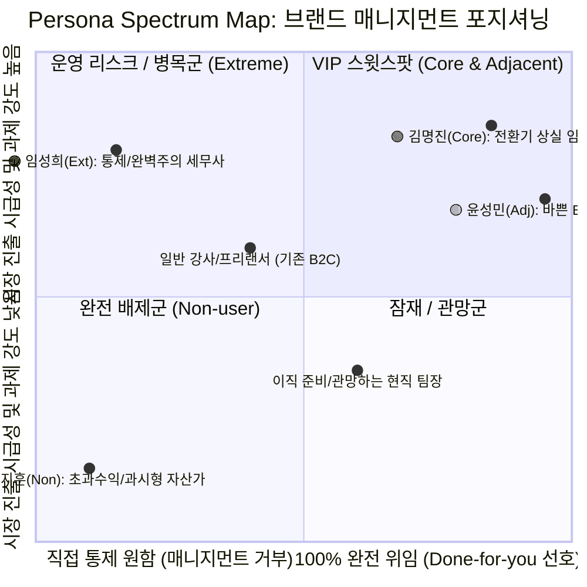
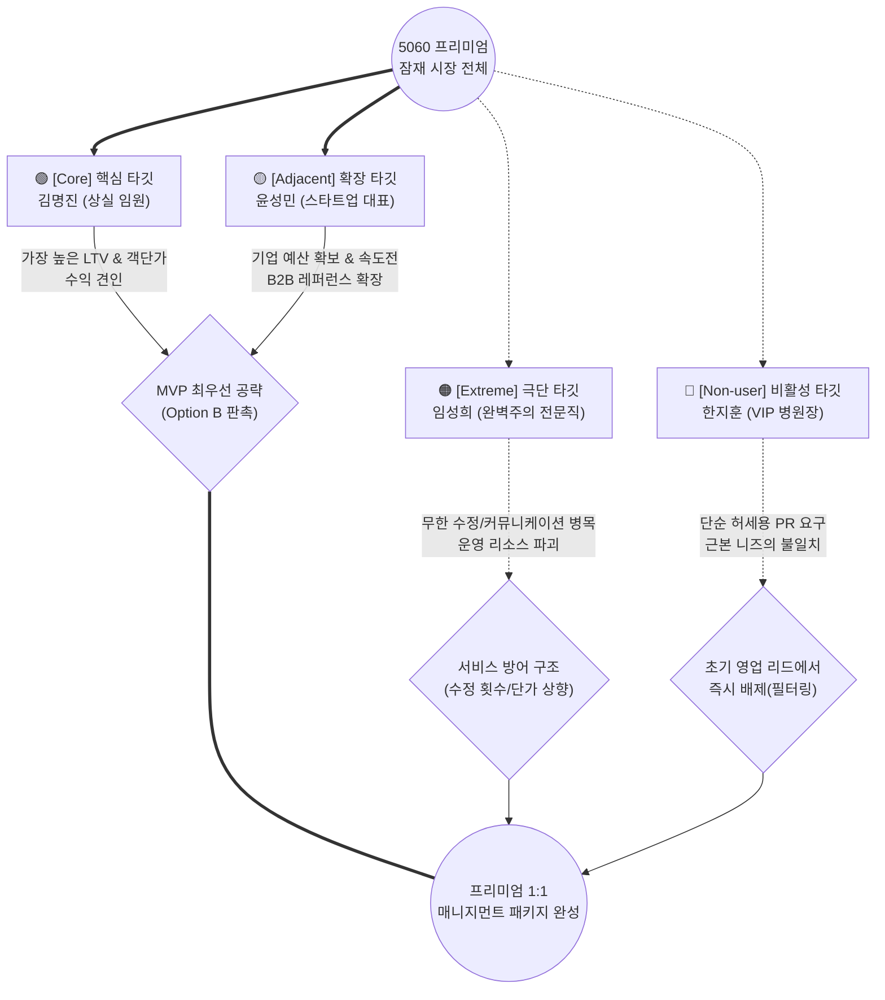

# 5060 프리미엄 매니지먼트: Persona Spectrum Map 시각화 가이드

고객 페르소나 4인을 하나의 생태계 안에서 구조화하여 볼 수 있는 **Persona Spectrum Map** 시각화 모델입니다. 본 비즈니스의 핵심 성공 요인인 **'고객이 얼마나 급한가(시급성)'**와 **'서비스에 얼마나 의존(위임)하는가'**를 기준으로 매핑했습니다.

---

## 📊 1. Mermaid 시각화: 페르소나 포지셔닝 맵 (Quadrant Chart)
이 차트는 4명의 페르소나가 시장 내에서 각각 어떤 사분면에 위치하고 있는지, 타깃의 우선순위가 어떻게 되는지 직관적으로 보여줍니다. 노션이나 마크다운 지원 에디터에서 바로 시각화되어 나타납니다.

---

## 🔗 2. Mermaid 시각화: 페르소나 관계도와 비즈니스 영향 분석
각 페르소나가 우리 서비스(MVP)와 어떻게 상호작용하고 비즈니스 지표에 어떤 영향을 미치는지 보여주는 관계 구조 흐름도입니다.

---

## 🎨 3. Figma(피그마) 비주얼 매핑 디자인 가이드

위 로직을 로고/일러스트 등을 활용해 피그마에서 시각적으로 화려하게(보고서 및 제안서 레벨로) 디자인하실 때 활용할 수 있는 프레임워크 가이드입니다.

### 1) 배경 매트릭스 그리기 (2x2 Matrix)
* **[가로 X축] 위임 수용성(Delegation)**: `좌측(내가 다 통제해야 함)` ↔ `우측(전문가에게 알아서 맡김)`
* **[세로 Y축] 직면한 고통의 크기(Pain Intensity)**: `하단(배부름, 아쉬울 게 없음)` ↔ `상단(무대가 비어있어 미칠 것 같음)`

### 2) 페르소나 카드 배치 및 디자인 처리

1. **김명진 & 윤성민 (우상단 / 1사분면)** 
    * **색상 처리**: 진한 메인 브랜드 컬러 활성화 (지정된 테마 컬러)로 Hot Zone 설정
    * **시각적 태그**: `#수익창출` `#Done_For_You_수요` `#자금력_풍부`
    * 가장 눈에 띄게 배치하고 폰트 사이즈를 키워 시각적 포커스를 집중.

2. **임성희 (좌상단 / 2사분면)**
    * **색상 처리**: 경고/주의 색상 (주황 계열 테두리 또는 아이콘 적용)
    * **시각적 태그**: `#운영의_블랙홀` `#완벽주의` `#마이크로매니징`
    * 서비스의 블랙홀 지점임을 알 수 있도록 점선 화살표를 통해 *'주의 요망(서비스 병목 지점)'* 레이블 연결.

3. **한지훈 (좌하단 / 3사분면)**
    * **색상 처리**: 흑백 또는 오파시티(Opacity) 30%로 투명하게 처리, 혹은 배경에 희미한 X표 처리 (Cold Zone)
    * **시각적 태그**: `#광고_대행_요망` `#비즈니스_미스매치`
    * 우리 서비스에서는 완전히 배제된 시장임을 시각적으로 낮춰 표현.
